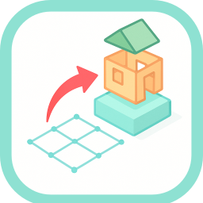
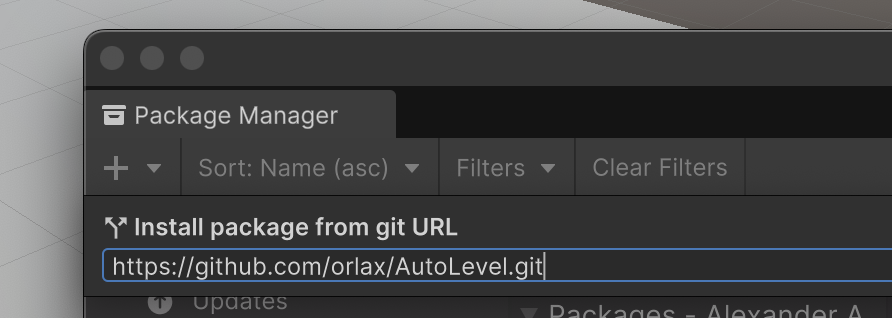
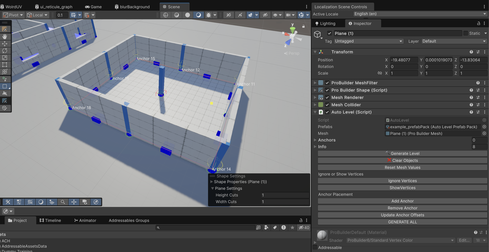
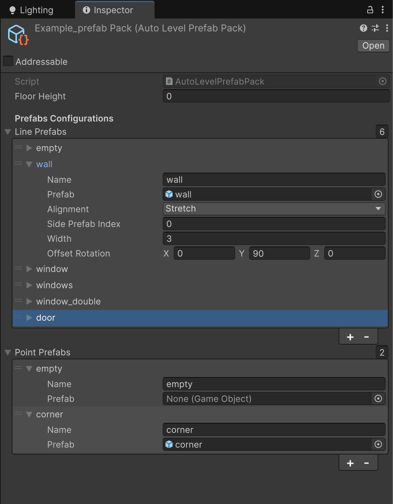

# Auto Level

Is a Level building tool to turn simple pro builder meshes into 3d levels in Unity with a high level of customization. 

**Watch this video for a quick demo of how it is done:**
<iframe width="560" height="415" src="https://www.youtube.com/embed/Uy8oB2Jq63g?si=O57RKdTU_KFYl46r" title="YouTube video player" frameborder="0" allow="accelerometer; autoplay; clipboard-write; encrypted-media; gyroscope; picture-in-picture; web-share" referrerpolicy="strict-origin-when-cross-origin" allowfullscreen></iframe>

---

## Installation 
You can instal the package with Unity´s package manager. via the github url:

```
https://github.com/orlax/AutoLevel.git

```

Make sure to have the ".git" at the end of the URL or it might fail! 

Go to **Window > Package Manager > click on the plus button > Add Package with Git URL**

---

## How to use
1. Create a new Pro builder mesh, it should be a "flat" mesh, meaning a plane or a sprite. 
2. Add the **AutoLevel** component to it.
3. Drag the pro builder mesh into the component and select a "Prefab Pack" 

If you import the samples from the package you should have a Prefab pack asset with some basic elements to test with.
4. Click the **Generate Level** button. 
5. You should see the prefabs being instantiated, you can click on the Lines and Points object to swap the prefab they instantiate. 
you can also Edit the probuilder mesh and click the Generate Level button again to see the changes. 

### Create your own asset pack
To use your own assets, create a new asset pack object by righ clicking on your project and selecting **create>Auto Level>PrefabPack**
the created asset allows you to configure your own prefabs to be spawned by an Auto Level Component, lets take a look at the options:



There are two lists of objects, one for lines and one for points. 

#### Lines
- **name** is a descriptive name that appears on the select menu when swapping prefabs
- **prefab** the actual game object that will be spawned.
- **aligment** defines how the game object will be spawned and scaled to fill the line: 
    - **Strecth** will spawn one single object and scale it on the Z axis to fill the line
    - **Repeat** will spawn many game objects to fill the line, calculating how many using the **width** parameter.
    - **Center** will spawn one game object at the center and if needed fill the sides with another game object indicated by the **side prefab index** parameter, this would be an index for a Line object in the same PrefabPack
- **width** indicates how wide the object is for the aligment calculations
- **side prefab index** Indicates what prefab to use to fill the sides of a centered object
- **Offset Rotation** allows to indicate an extra rotation to be applied to the spawned objects.

#### Points
- **name** is a descriptive name that appears on the selected menu
- **prefab** the actual game object that will be spawned at the point position.

Finally, all your PrefabPacks should have at least two objects on each list, the first item must always remain Empty and from the second onwards use your own configured prefabs

---

## How does this work?
If you are interested in how does this work and or would like to collaborate in the development. 

Check out the details here: [How does it work](HOW.md)

---

## What´s next?

The current version of this tools comes straight from my current game development project, so it has bugs, and is very specific to my problems. 

I intend to resolve bugs and add the features that make more sense to my use case. Hopefully it will be usefull for someone else out there as well.

my current bucket list: 
- the offset rotation does not seem to be working
- there are some parameters that are not being used, so I will remove them.
- the custom editor can probably be improved
- quality of life fixes
- add new features, just not sure wich ones.


---

## License

This project is licensed under the GNU LESSER GENERAL PUBLIC LICENSE Version 3. See the [LICENSE.md](LICENSE.md) file for details.

You are free to use this package in personal and commercial projects. If you modify the source code of this package, you are required to share those modifications under the LGPLv3 license. Please provide attribution to the original project.